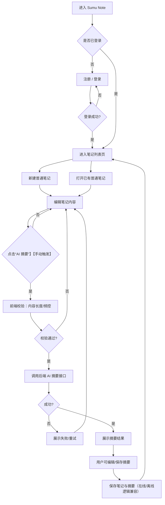
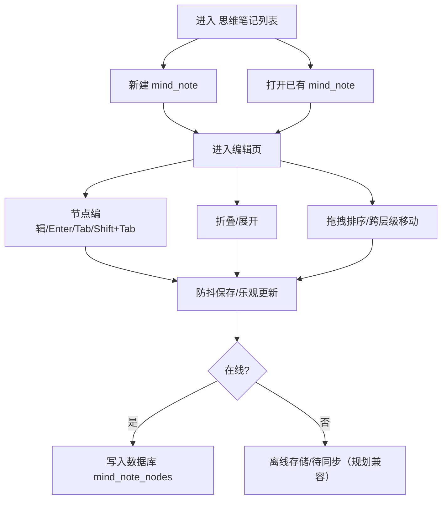
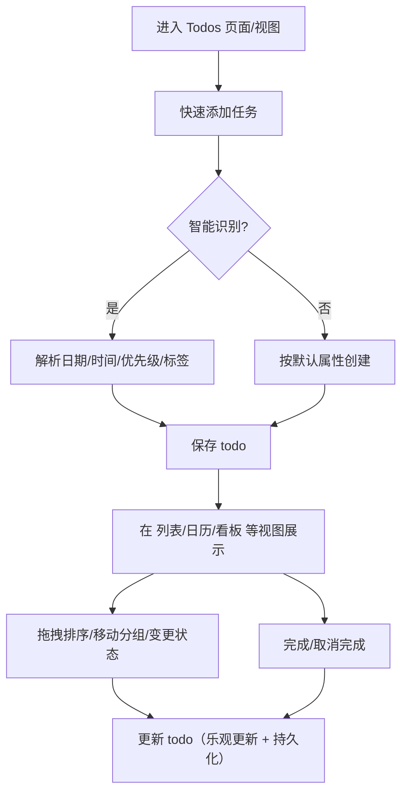

# Sumu Note PRD（标准版）

- **产品名称**：Sumu Note  
- **文档名称**：PRD - 核心能力（登录 / 笔记 / AI 摘要）+ 思维笔记（mind_notes）+ 任务管理（todos）  
- **文档版本**：V1.0  
- **状态**：Draft  
- **作者**：—  
- **评审人**：—  
- **最后更新**：2026-01-20  

---

## 文档版本记录

| 版本 | 日期 | 作者 | 变更说明 |
|---|---|---|---|
| 0.1 | 2026-01-20 | — | 新建 PRD，覆盖核心能力（登录/笔记/AI 摘要） |
| 0.2 | 2026-01-20 | — | 补充 `mind_notes`（思维笔记）与 `todos`（任务管理）业务、规格、埋点 |
| 1.0 | 2026-01-20 | — | 评审定版 |

---

## 1. 产品概述

### 1.1 背景与现状（基于 docs 现有设计）

- **思维笔记（`mind_notes`）**：类幕布/Workflowy 的树形大纲编辑，支持无限层级、折叠展开、拖拽、快捷键、移动端工具栏等。
- **任务管理（`todos`）**：参考 TickTick / Apple Reminders 的任务系统设计，目标支持列表/日历/看板/时间线/甘特等视图（部分功能已实现/建议文档已覆盖）。
- **版本历史与离线支持**：已规划/实现基础设施（`note_versions` 版本表、离线存储模块等），需与“普通笔记”/AI 能力兼容。

### 1.2 本期目标

- **提供可靠登录体系**：统一身份，保障数据隔离（RLS）与跨端同步基础。
- **提供快速创建与编辑笔记**：覆盖“普通笔记”的创建/编辑/删除与列表管理。
- **提供 AI 自动摘要能力**：帮助用户快速提炼要点与行动项，形成产品差异化。
- **补齐产品级 PRD**：将 `mind_notes` 与 `todos` 以产品视角纳入统一流程、规格、埋点。

### 1.3 用户与场景

- **目标用户**：知识工作者、学生、自学者、轻量项目管理者。
- **核心场景**：
  - 记录：快速创建普通笔记，随时补充内容。
  - 结构化整理：用思维笔记做大纲梳理/会议纪要结构化。
  - 行动化：将笔记要点转为任务（本期仅埋点与规划兼容，不强制实现转化功能）。
  - 提炼：对长笔记生成 AI 摘要，提升复盘效率。

---

## 2. 范围说明

### 2.1 本期范围（必须交付）

1. **用户登录**
2. **普通笔记（notes）创建与管理**
3. **AI 自动摘要（针对普通笔记）**

### 2.2 同期补充纳入 PRD（以现有 docs 为准）

4. **思维笔记（`mind_notes`）**
5. **任务管理（`todos`）**

> 说明：4/5 的实现状态以项目现状为准，本 PRD 侧重“产品规格、输入输出、埋点与流程统一”，便于后续迭代评审与排期。

### 2.3 非本期（明确不做）

- 多人协作（评论、共享、分配）。
- 笔记附件/图片/富文本全量（可留接口）。
- 复杂冲突解决（离线/多端冲突采用简化策略）。

---

## 3. 业务流程（Mermaid）

### 3.1 核心主流程：登录 → 创建普通笔记 → AI 摘要

### 3.2 思维笔记流程：创建 → 编辑树节点 → 自动保存

### 3.3 任务管理流程：创建任务 → 视图操作 → 完成/取消完成

---

## 4. 功能需求（详细规格：输入/输出/限制）

## 4.1 用户登录（Auth）

### 4.1.1 功能点

- **注册/登录**：邮箱 + 密码（与 Supabase Auth 兼容）。
- **登录态管理**：刷新可恢复；退出清理本地状态。
- **权限与数据隔离**：所有数据接口需校验 `auth.uid()`（RLS）。

### 4.1.2 输入/输出/限制

- **输入**
  - `email`：最长 254 字符；必须是有效邮箱格式。
  - `password`：6–64 字符；支持常见符号。
- **输出**
  - 成功：`user`、`session/access_token`。
  - 失败：401/403（认证失败）、429（频控/保护，若启用）。
- **限制**
  - 失败提示避免泄露安全信息（统一“账号或密码错误”）。
  - 连续失败 N 次触发延迟/验证码（后端策略，前端按错误码展示文案）。

---

## 4.2 普通笔记（Notes）：创建/编辑/删除/列表

### 4.2.1 功能点

- **创建笔记**
  - 列表页点击“新建”，生成空白笔记，默认标题“未命名笔记 + 时间”。
- **编辑笔记**
  - 标题/内容编辑；防抖保存；在线写入、离线入队（兼容离线模块）。
  - 内容辅助：支持 `[[` 双向链接补全（候选笔记、↑↓/Enter 导航、插入 `[[id|label]]`）与 `#` 标签补全（候选标签、↑↓/Enter 导航、插入 `#tag `）。
- **删除笔记**
  - 软删除 `is_deleted=true`，默认不展示（回收站非本期）。
- **撤销删除/创建（Toast + Undo）**
  - 普通列表页删除笔记、编辑页“删除当前笔记”统一采用“移入回收站”的软删除策略，并在 Toast 中提供短时间的撤销按钮。
  - 新建空白笔记后，允许通过 Toast 撤销并删除该空白笔记（用于纠正误触）。
  - 回收站中的“彻底删除”操作为不可撤销，需 Dialog 二次确认且不提供 Undo。
- **版本历史（兼容）**
  - 每次有效保存可创建版本（节流），每篇最多保留 50 个版本。

### 4.2.2 数据字段（产品定义）

- `title`：1–200 字符
- `content`：0–50,000 字符（存储上限）
- `tags`：0–500 字符（预留）
- `ai_summary`：0–1,000 字符（建议字段/单独表也可）

### 4.2.3 输入/输出/限制

- **创建/更新输入**
  - `title`：空则自动填默认标题；超 200 截断并提示。
  - `content`：超 50,000 截断并提示（“超出部分不会被保存”）。
- **输出**
  - 成功：Note 对象（含 `id`, `created_at`, `updated_at`）。
  - 失败：400/401/403/500。
- **版本历史限制**
  - 版本生成节流：同一篇笔记 **≥10s** 才允许新增版本（避免高频输入产生大量版本）。
  - 版本数量：最多 **50**（按 docs 规划自动清理）。

---

## 4.3 AI 自动摘要（Notes）

### 4.3.1 功能点

- **触发**：笔记编辑页手动点击“AI 摘要”（默认不自动调用）。
- **展示**：摘要独立区域三态（空/生成中/成功/失败）。
- **操作**：重新生成、编辑摘要并保存。
- **频控**：前端拦截 + 后端兜底。

### 4.3.2 输入/输出/限制（产品约束）

- **前端触发校验**
  - 内容长度 < 20 字符：不调用，提示“内容太少，暂不支持生成摘要”。
  - 单篇笔记频控：每 30 秒最多 1 次。
  - 账号日配额：默认 50 次/天（可配置）。
- **AI 请求输入（逻辑）**
  - 超长内容裁剪（建议）：取“前 2000 字符 + 后 2000 字符”并标记省略。
- **AI 输出**
  - `summary`：≤ 1000 字符（超出截断并提示“已为你精简到可读长度”）。
- **失败处理**
  - AI 超时：15 秒；展示“生成超时，请重试”并保留旧摘要。

---

## 4.4 思维笔记（`mind_notes` / `mind_note_nodes`）

> 参考：`docs/requirements/MIND_NOTE_REQUIREMENTS.md` 与 `docs/features/MIND_NOTE_FEATURE.md`

### 4.4.1 核心功能（用户可感知）

- **大纲树结构**
  - 无限层级父子节点
  - 节点折叠/展开；支持“折叠全部/展开全部”
- **节点编辑**
  - 单击进入编辑；失焦保存；输入防抖保存
  - 空节点可创建、可删除（Backspace 删除空节点）
- **快捷键（桌面端核心）**
  - Enter：创建同级节点
  - Tab：创建子节点
  - Shift+Tab：提升层级
  - Backspace：删除空节点（光标行首）
- **拖拽重排**
  - 拖拽改变顺序与层级
  - 拖拽规则：上半作为子节点，下半作为同级节点
- **文档管理**
  - 列表：创建/查看/删除/重命名
  - 文件夹管理：分类、拖拽到文件夹
  - 搜索：标题+内容

### 4.4.2 输入/输出/限制

- **节点内容**
  - `content`：0–5,000 字符（建议限制；过长会影响编辑性能）
  - 仅纯文本为基础；`**bold**`、`==highlight==` 等标记可作为兼容格式（以现有实现为准）
- **树深限制**
  - 产品不设硬限制，但建议在 UI 提示极深层级（如 > 20 层）可能影响可读性。
- **拖拽限制**
  - 不允许把节点拖拽到自身及其子孙节点之下（循环引用保护）。

---

## 4.5 任务管理（`todos` / `todo_lists`）

> 参考：`docs/requirements/TODO_MANAGEMENT_REQUIREMENTS.md` 与 `docs/features/TODO_FEATURE_SUGGESTIONS.md`

### 4.5.1 核心功能（产品规格）

- **快速添加任务**
  - 标题必填；支持回车创建
  - 智能识别（规划/部分已实现）：日期、时间、标签、优先级（如“明天下午3点开会 #工作 @重要”）
- **任务属性**
  - `title`（必填）
  - `description`（可选）
  - `priority`：0/1/2/3
  - `status`：todo / in_progress / done / archived
  - `due_date`、`reminder_time`
  - `tags[]`、`list_id`
  - `parent_id`（子任务）
- **视图（产品层）**
  - 列表视图（基础）
  - 日历视图（拖拽改期）
  - 看板视图（状态列/自定义列扩展）
  - 时间线/甘特（扩展视图）
- **完成/取消完成**
  - 任务卡片/列表快速完成；同步更新统计（若有）
- **关键操作的可撤销性（Toast + Undo）**
  - 支持对部分破坏性操作（如删除任务、从视图中移除但未彻底删除的数据）提供短时间内可点击的撤销入口。
  - 撤销入口以 Toast +「撤销」按钮形式呈现，撤销窗口推荐为 3–5 秒。
  - 真正不可逆的操作（如回收站中的“彻底删除”）不提供撤销，仅通过 Dialog 明确告知风险。

### 4.5.2 输入/输出/限制

- **创建/更新输入**
  - `title`：1–200 字符；为空不允许提交。
  - `description`：0–5,000 字符（建议限制）。
  - `tags`：最多 20 个；每个标签 1–20 字符。
  - `due_date`：ISO 时间字符串；必须带时区或约定为用户时区。
- **智能识别限制**
  - 识别失败不阻塞创建：将全部文本作为 `title` 保存，并提示“未识别到日期/优先级”。
- **拖拽/批量操作限制**
  - 视图拖拽需做乐观更新；失败回滚并提示。

---

## 5. 非功能需求（NFR）

### 5.1 性能

- 列表页首屏：正常网络下 ≤ 2s 可交互。
- 思维笔记：100+ 节点仍可流畅编辑；折叠节点不渲染子树（已规划/实现）。
- AI 摘要：超时 15s；失败可重试。

### 5.2 可用性

- 新用户首日完成率（建议指标）：
  - 创建至少 1 篇普通笔记 ≥ 80%
  - 触发至少 1 次 AI 摘要 ≥ 40%

### 5.3 兼容性

- 桌面端：Chrome / Edge / Firefox / Safari 最近 2 个大版本。
- 移动端：iOS Safari / Chrome Mobile 基本可用。

---

## 6. 数据埋点需求（统一口径）

> 事件命名建议：小写下划线；所有事件均携带公共字段（用户、设备、页面、版本等）。

### 6.1 公共字段（所有事件必带）

- `user_id`
- `platform`（web / mobile_web）
- `os`、`browser`
- `app_version`
- `page_path`
- `ts`（事件时间）

### 6.2 核心事件（登录 / Notes / AI）

| 事件名 | 触发时机 | 属性（示例） |
|---|---|---|
| `user_signup` | 注册成功 | `method=email` |
| `user_login` | 登录成功 | `method=email` |
| `user_logout` | 退出登录 |  |
| `note_create` | 新建普通笔记成功 | `note_id`, `source=button/shortcut` |
| `note_view` | 打开普通笔记 | `note_id`, `content_len_bucket`, `has_ai_summary` |
| `note_edit_save` | 普通笔记保存成功 | `note_id`, `delta_len`, `save_type=online/offline` |
| `note_delete` | 删除普通笔记 | `note_id`, `note_age_days` |
| `ai_summary_click` | 点击 AI 摘要按钮 | `note_id`, `content_len`, `from_state=empty/exist` |
| `ai_summary_request` | 前端发起摘要请求 | `note_id`, `retry_count` |
| `ai_summary_success` | 摘要成功展示 | `note_id`, `summary_len`, `latency_ms`, `model` |
| `ai_summary_fail` | 摘要失败 | `note_id`, `error_code`, `latency_ms` |
| `ai_summary_edit_save` | 用户编辑摘要并保存 | `note_id`, `origin_len`, `final_len`, `edit_distance_bucket` |

### 6.3 思维笔记事件（`mind_notes`）

| 事件名 | 触发时机 | 属性（示例） |
|---|---|---|
| `mind_note_create` | 新建思维笔记成功 | `mind_note_id`, `source` |
| `mind_note_view` | 打开思维笔记编辑页 | `mind_note_id`, `node_count_bucket` |
| `mind_node_create` | 创建节点（Enter/Tab/按钮） | `mind_note_id`, `node_id`, `method=enter/tab/button`, `level` |
| `mind_node_edit_save` | 节点编辑保存成功 | `mind_note_id`, `node_id`, `delta_len`, `save_type` |
| `mind_node_delete` | 删除节点 | `mind_note_id`, `node_id`, `has_children` |
| `mind_node_drag` | 拖拽完成（排序/换层级） | `mind_note_id`, `node_id`, `from_parent`, `to_parent`, `from_index`, `to_index` |
| `mind_note_search` | 搜索思维笔记 | `query_len`, `result_count` |

### 6.4 任务管理事件（`todos`）

| 事件名 | 触发时机 | 属性（示例） |
|---|---|---|
| `todo_create` | 创建任务成功 | `todo_id`, `source=input/button`, `recognized=true/false` |
| `todo_update` | 更新任务成功（属性变更） | `todo_id`, `changed_fields[]` |
| `todo_complete` | 完成任务 | `todo_id`, `view=list/calendar/kanban` |
| `todo_uncomplete` | 取消完成 | `todo_id` |
| `todo_delete` | 删除任务 | `todo_id`, `is_soft_delete` |
| `todo_drag` | 拖拽任务（排序/改期/换列） | `todo_id`, `view`, `from`, `to` |
| `todo_list_create` | 创建清单 | `list_id` |
| `todo_view_switch` | 切换视图 | `from_view`, `to_view` |

### 6.5 离线与同步事件（兼容）

| 事件名 | 触发时机 | 属性（示例） |
|---|---|---|
| `offline_enter` | 网络变为离线 |  |
| `offline_exit` | 网络恢复在线 |  |
| `offline_save` | 离线保存（笔记/思维笔记/任务） | `entity=note/mind_note/todo`, `entity_id` |
| `offline_sync` | 同步执行完成 | `success_count`, `fail_count`, `conflict_count` |

---

## 7. 风险与待决事项

- **AI 供应商与成本**：模型选择、配额、缓存与降级策略待确认。
- **跨模块一致性**：`notes` / `mind_notes` / `todos` 的“离线与版本历史”统一策略需单独评审。
- **体验一致性**：三种内容形态（普通笔记、思维笔记、任务）入口与导航信息架构需产品/UI 再梳理。

