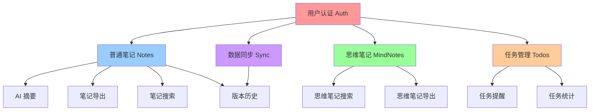

# Sumu Note 功能依赖关系图

> **最后更新**: 2026-01-XX  
> **维护者**: [维护者名称]

---

## 📊 功能模块总览

```
┌─────────────────────────────────────────────────────────────┐
│                     Sumu Note 产品架构                      │
└─────────────────────────────────────────────────────────────┘
                              │
        ┌─────────────────────┼─────────────────────┐
        │                     │                     │
   ┌────▼────┐          ┌─────▼─────┐        ┌─────▼─────┐
   │ 用户认证 │          │  普通笔记  │        │  思维笔记  │
   │  (Auth)  │          │  (Notes)  │        │(MindNotes)│
   └────┬────┘          └─────┬─────┘        └─────┬─────┘
        │                     │                     │
        └─────────────────────┼─────────────────────┘
                              │
                    ┌─────────▼─────────┐
                    │    任务管理        │
                    │     (Todos)       │
                    └───────────────────┘
```

---

## 🔗 核心功能依赖关系

### 1. 用户认证模块 (Auth)

**功能描述**: 用户登录、注册、身份验证

**依赖关系**:
- ✅ **无前置依赖**（基础模块）
- ✅ **被依赖模块**：
  - 普通笔记 (Notes) - 需要用户身份
  - 思维笔记 (MindNotes) - 需要用户身份
  - 任务管理 (Todos) - 需要用户身份
  - 数据同步 - 需要用户身份
  - 离线存储 - 需要用户身份

**技术依赖**:
- Supabase Auth
- RLS (Row Level Security) 策略

---

### 2. 普通笔记模块 (Notes)

**功能描述**: 笔记创建、编辑、删除、列表管理

**依赖关系**:
- ✅ **前置依赖**：
  - 用户认证 (Auth) - 必须
- ✅ **被依赖模块**：
  - AI 摘要 - 依赖笔记内容
  - 笔记导出 - 依赖笔记数据
  - 笔记搜索 - 依赖笔记数据
  - 版本历史 - 依赖笔记数据
  - 离线同步 - 依赖笔记数据

**子功能依赖关系**:
```
笔记基础功能 (Notes Core)
  ├─ 笔记列表 (NoteList)
  │   └─ 文件夹管理 (Folder) - 可选
  ├─ 笔记编辑 (NoteEditor)
  │   ├─ Markdown 渲染 (MarkdownRenderer)
  │   ├─ 查找替换 (FindReplace) - 可选
  │   ├─ 表格编辑 (TableEditor) - 可选
  │   └─ 笔记统计 (NoteStats) - 可选
  ├─ 笔记搜索 (NoteSearch)
  │   └─ 全局搜索 (GlobalSearch) - 可选
  └─ 笔记导出 (NoteExport) - 可选
```

**技术依赖**:
- Supabase Database (notes 表)
- Markdown 解析库 (react-markdown)
- 表格工具库 (table-utils)

---

### 3. 思维笔记模块 (MindNotes)

**功能描述**: 树形大纲笔记，支持无限层级

**依赖关系**:
- ✅ **前置依赖**：
  - 用户认证 (Auth) - 必须
- ✅ **被依赖模块**：
  - 思维笔记搜索 - 依赖思维笔记数据
  - 思维笔记导出 - 依赖思维笔记数据（可选）

**子功能依赖关系**:
```
思维笔记核心功能 (MindNotes Core)
  ├─ 节点树结构 (NodeTree)
  │   ├─ 节点创建/删除 (NodeCRUD)
  │   ├─ 节点拖拽 (NodeDrag) - 依赖 @dnd-kit
  │   └─ 节点折叠/展开 (NodeFold)
  ├─ 节点编辑 (NodeEditor)
  │   └─ 防抖保存 (DebounceSave)
  ├─ 文件夹管理 (Folder) - 可选
  └─ 快捷键支持 (KeyboardShortcuts)
```

**技术依赖**:
- Supabase Database (mind_notes, mind_note_nodes 表)
- @dnd-kit (拖拽功能)
- 树形结构算法

---

### 4. 任务管理模块 (Todos)

**功能描述**: 任务创建、管理、多种视图

**依赖关系**:
- ✅ **前置依赖**：
  - 用户认证 (Auth) - 必须
- ✅ **被依赖模块**：
  - 任务提醒 (TodoReminder) - 可选
  - 任务统计 (TodoStats) - 可选

**子功能依赖关系**:
```
任务管理核心功能 (Todos Core)
  ├─ 任务基础功能 (TodoCRUD)
  │   ├─ 任务创建 (CreateTodo)
  │   ├─ 任务编辑 (EditTodo)
  │   └─ 任务删除 (DeleteTodo)
  ├─ 任务属性 (TodoAttributes)
  │   ├─ 日期时间 (DueDate)
  │   ├─ 优先级 (Priority)
  │   ├─ 标签 (Tags)
  │   └─ 清单分组 (Lists)
  ├─ 视图模式 (TodoViews)
  │   ├─ 列表视图 (ListView) - 基础
  │   ├─ 日历视图 (CalendarView) - 可选
  │   ├─ 看板视图 (KanbanView) - 可选
  │   ├─ 时间线视图 (TimelineView) - 可选
  │   └─ 甘特图视图 (GanttView) - 可选
  ├─ 高级功能 (AdvancedFeatures)
  │   ├─ 智能识别 (SmartParse) - 可选
  │   ├─ 重复任务 (RecurringTasks) - 可选
  │   ├─ 子任务 (Subtasks) - 可选
  │   └─ 批量操作 (BatchOperations) - 可选
  └─ 搜索筛选 (SearchFilter)
      ├─ 搜索功能 (Search)
      └─ 高级筛选 (AdvancedFilter)
```

**技术依赖**:
- Supabase Database (todos, todo_lists 表)
- @dnd-kit (拖拽功能)
- 日期处理库 (date-fns)

---

### 5. AI 摘要模块 (AI Summary)

**功能描述**: 对笔记内容生成 AI 摘要

**依赖关系**:
- ✅ **前置依赖**：
  - 用户认证 (Auth) - 必须
  - 普通笔记 (Notes) - 必须（需要笔记内容）
- ✅ **被依赖模块**：
  - 无

**技术依赖**:
- AI API (OpenAI / 其他)
- 笔记内容处理

---

### 6. 数据同步模块 (Sync)

**功能描述**: 在线/离线数据同步

**依赖关系**:
- ✅ **前置依赖**：
  - 用户认证 (Auth) - 必须
  - 普通笔记 (Notes) - 可选
  - 思维笔记 (MindNotes) - 可选
  - 任务管理 (Todos) - 可选
- ✅ **被依赖模块**：
  - 版本历史 (VersionHistory) - 可选

**子功能依赖关系**:
```
数据同步 (Sync)
  ├─ 实时同步 (RealtimeSync)
  │   └─ Supabase Realtime
  ├─ 离线存储 (OfflineStorage)
  │   └─ IndexedDB / LocalStorage
  └─ 冲突解决 (ConflictResolution)
```

**技术依赖**:
- Supabase Realtime
- IndexedDB API
- 离线存储工具 (offline-storage.ts)

---

### 7. 版本历史模块 (Version History)

**功能描述**: 笔记版本管理和历史记录

**依赖关系**:
- ✅ **前置依赖**：
  - 用户认证 (Auth) - 必须
  - 普通笔记 (Notes) - 必须
  - 数据同步 (Sync) - 可选
- ✅ **被依赖模块**：
  - 无

**技术依赖**:
- Supabase Database (note_versions 表)
- 版本比较算法

---

## 📈 功能优先级与依赖关系矩阵

| 功能模块 | 优先级 | 前置依赖 | 被依赖模块 | 实现状态 |
|---------|--------|---------|-----------|---------|
| 用户认证 (Auth) | P0 | 无 | Notes, MindNotes, Todos | ✅ 已完成 |
| 普通笔记 (Notes) | P0 | Auth | AI Summary, Export, Search | ✅ 已完成 |
| 思维笔记 (MindNotes) | P1 | Auth | 无 | ✅ 已完成 |
| 任务管理 (Todos) | P1 | Auth | Reminder, Stats | ✅ 部分完成 |
| AI 摘要 (AI Summary) | P2 | Auth, Notes | 无 | ⏳ 待实现 |
| 数据同步 (Sync) | P1 | Auth | Version History | ✅ 部分完成 |
| 版本历史 (Version History) | P2 | Auth, Notes, Sync | 无 | ✅ 部分完成 |

---

## 🔄 功能依赖流程图



---

## 🎯 功能实现建议顺序

### Phase 1: 基础架构（必须）
1. ✅ 用户认证 (Auth)
2. ✅ 普通笔记基础功能 (Notes Core)
3. ✅ 数据同步基础 (Sync Core)

### Phase 2: 核心功能（高优先级）
4. ✅ 思维笔记基础功能 (MindNotes Core)
5. ✅ 任务管理基础功能 (Todos Core)
6. ✅ 笔记增强功能（查找替换、表格、统计）

### Phase 3: 扩展功能（中优先级）
7. ⏳ AI 摘要 (AI Summary)
8. ✅ 笔记导出 (Note Export)
9. ✅ 版本历史 (Version History)
10. ⏳ 任务高级功能（重复任务、子任务等）

### Phase 4: 优化功能（低优先级）
11. ⏳ 任务多种视图（日历、看板、甘特图）
12. ⏳ 思维笔记高级功能（Markdown、LaTeX）
13. ⏳ 性能优化和用户体验优化

---

## 📝 依赖关系说明

### 强依赖（必须）
- **用户认证 → 所有功能模块**: 所有功能都需要用户身份验证
- **普通笔记 → AI 摘要**: AI 摘要需要笔记内容作为输入
- **数据同步 → 版本历史**: 版本历史需要同步机制来记录变更

### 弱依赖（可选）
- **文件夹管理**: 可以独立实现，但增强笔记组织能力
- **笔记导出**: 可以独立实现，但依赖笔记数据
- **任务提醒**: 可以独立实现，但依赖任务数据

### 冲突关系
- **实时同步 vs 离线存储**: 需要处理冲突解决机制
- **多个视图模式**: 需要统一数据模型，但可以独立实现UI

---

## 🔧 技术债务与依赖风险

### 高风险依赖
1. **Supabase 服务依赖**: 如果 Supabase 服务不可用，整个应用无法工作
   - **缓解措施**: 实现离线存储和同步机制

2. **AI API 依赖**: AI 摘要功能依赖外部 API
   - **缓解措施**: 实现降级方案，API 不可用时提示用户

### 技术债务
1. **表格编辑功能**: 当前实现较复杂，存在性能问题
   - **建议**: 考虑重构为更简单的实现

2. **实时同步逻辑**: 存在误报"云端更新"的问题
   - **状态**: 已部分修复，需要持续优化

---

## 📚 相关文档

- [PRD 文档](./PRD_SUMU_NOTE.md)
- [需求分析文档](./requirements/需求分析_滑动误触与笔记功能增强.md)
- [任务管理需求](./requirements/TODO_MANAGEMENT_REQUIREMENTS.md)
- [思维笔记需求](./requirements/MIND_NOTE_REQUIREMENTS.md)

---

## 🔄 更新记录

| 日期 | 更新内容 | 更新人 |
|------|---------|--------|
| 2026-01-XX | 创建功能依赖关系图 | [创建者] |
