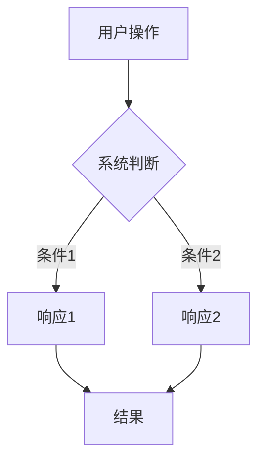

# 需求描述模板

> **使用说明**：填写此模板时，请删除所有示例文本和说明性文字，保留实际内容。

---

## 📋 基本信息

- **需求ID**: `REQ-YYYYMMDD-XXX`（格式：REQ-日期-序号）
- **需求名称**: [简短描述需求的核心功能]
- **提出人**: [姓名/角色]
- **提出时间**: YYYY-MM-DD
- **优先级**: 🔴 P0（必须）| 🟢 P1（高）| 🟡 P2（中）| 🔵 P3（低）
- **状态**: 📝 待分析 | 🔍 分析中 | ✅ 已确认 | 🚧 开发中 | ✅ 已完成 | ❌ 已取消

---

## 🎯 需求概述

### 问题描述
**当前遇到什么问题？**
- [ ] 用户痛点：描述用户在使用过程中遇到的具体问题
- [ ] 业务痛点：描述业务层面的问题或限制
- [ ] 技术痛点：描述技术层面的问题或限制

**问题影响范围**：
- 影响用户：[描述哪些用户受影响]
- 影响场景：[描述在什么场景下会出现问题]
- 影响程度：[高/中/低]

### 目标描述
**希望达到什么效果？**
- [ ] 用户目标：用户能够做什么
- [ ] 业务目标：业务能够获得什么价值
- [ ] 技术目标：技术层面需要达到什么标准

### 用户故事（可选）
```
作为 [用户角色]
我希望 [功能描述]
以便 [价值/目标]
```

---

## 📖 详细需求

### 功能描述
**具体要实现什么功能？**

1. **核心功能**：
   - [功能点1]：[详细描述]
   - [功能点2]：[详细描述]
   - [功能点3]：[详细描述]

2. **扩展功能**（可选）：
   - [功能点1]：[详细描述]
   - [功能点2]：[详细描述]

### 使用场景
**在什么情况下使用？**

**场景1：**[场景名称]
- 触发条件：[什么情况下触发]
- 用户操作：[用户如何操作]
- 系统响应：[系统如何响应]
- 预期结果：[期望达到什么效果]

**场景2：**[场景名称]
- [同上]

### 交互流程
**用户如何与功能交互？**



或使用文字描述：
1. 用户执行操作A
2. 系统判断条件B
3. 如果条件B满足，执行C；否则执行D
4. 显示结果E

---

## 🔍 边界条件

### 功能边界
**什么情况下不适用？**
- [ ] 限制条件1：[描述]
- [ ] 限制条件2：[描述]

### 数据边界
**数据范围和处理规则**
- [ ] 数据量限制：[最大/最小数据量]
- [ ] 数据类型限制：[支持的数据类型]
- [ ] 数据格式要求：[数据格式规范]

### 性能边界
**性能要求和限制**
- [ ] 响应时间：[最大响应时间]
- [ ] 并发处理：[最大并发数]
- [ ] 资源消耗：[CPU/内存/存储限制]

### 兼容性边界
**兼容性要求**
- [ ] 浏览器支持：[支持的浏览器版本]
- [ ] 设备支持：[支持的设备类型]
- [ ] 操作系统支持：[支持的操作系统]

---

## 🔗 依赖关系

### 前置依赖
**需要先完成的功能或任务**
- [ ] 依赖1：[功能/任务名称] - [说明为什么依赖]
- [ ] 依赖2：[功能/任务名称] - [说明为什么依赖]

### 关联功能
**与哪些功能有关联？**
- [ ] 关联功能1：[功能名称] - [关联关系说明]
- [ ] 关联功能2：[功能名称] - [关联关系说明]

### 潜在冲突
**可能与哪些功能产生冲突？**
- [ ] 冲突功能1：[功能名称] - [冲突原因和解决方案]
- [ ] 冲突功能2：[功能名称] - [冲突原因和解决方案]

---

## 🎨 UI/UX 要求

### 界面设计
**界面应该如何呈现？**
- [ ] 布局要求：[描述布局结构]
- [ ] 组件要求：[使用哪些UI组件]
- [ ] 样式要求：[颜色、字体、间距等]

### 交互设计
**用户如何与界面交互？**
- [ ] 操作方式：[点击/拖拽/键盘快捷键等]
- [ ] 反馈机制：[加载状态、成功提示、错误提示等]
- [ ] 动画效果：[是否需要动画，动画类型]

### 响应式设计
**不同设备上的表现**
- [ ] 桌面端：[布局和交互方式]
- [ ] 移动端：[布局和交互方式]
- [ ] 平板端：[布局和交互方式]（如适用）

### 无障碍设计（可选）
**无障碍访问要求**
- [ ] 键盘导航：[是否支持键盘操作]
- [ ] 屏幕阅读器：[是否支持屏幕阅读器]
- [ ] 颜色对比度：[是否符合WCAG标准]

---

## 🔧 技术实现要点

### 技术方案
**建议的技术实现方案**

**方案A：[方案名称]**
- 优点：[列出优点]
- 缺点：[列出缺点]
- 适用场景：[什么情况下使用]

**方案B：[方案名称]**
- 优点：[列出优点]
- 缺点：[列出缺点]
- 适用场景：[什么情况下使用]

**推荐方案**：[方案A/B] - [选择理由]

### 数据结构
**需要的数据结构**
```typescript
interface DataStructure {
  field1: type;
  field2: type;
  // ...
}
```

### API设计（如适用）
**需要的API接口**
- `GET /api/endpoint`：[接口描述]
- `POST /api/endpoint`：[接口描述]

### 数据库变更（如适用）
**需要的数据库变更**
- 新增表：[表名] - [用途]
- 修改表：[表名] - [修改内容]
- 新增字段：[表名.字段名] - [用途]

---

## ✅ 验收标准

### 功能验收
**功能是否完整实现？**
- [ ] 验收项1：[具体验收标准]
- [ ] 验收项2：[具体验收标准]
- [ ] 验收项3：[具体验收标准]

### 性能验收
**性能是否达标？**
- [ ] 响应时间：[具体指标]
- [ ] 并发处理：[具体指标]
- [ ] 资源消耗：[具体指标]

### UI/UX验收
**界面和交互是否符合要求？**
- [ ] 界面布局：[验收标准]
- [ ] 交互流畅：[验收标准]
- [ ] 响应式适配：[验收标准]

### 兼容性验收
**兼容性是否满足要求？**
- [ ] 浏览器兼容：[验收标准]
- [ ] 设备兼容：[验收标准]
- [ ] 操作系统兼容：[验收标准]

### 边界情况验收
**边界情况是否处理？**
- [ ] 空数据：[验收标准]
- [ ] 异常数据：[验收标准]
- [ ] 网络异常：[验收标准]
- [ ] 权限异常：[验收标准]

---

## 📊 优先级评估

### 业务价值
- **用户价值**：[高/中/低] - [说明]
- **业务价值**：[高/中/低] - [说明]
- **战略价值**：[高/中/低] - [说明]

### 实现成本
- **开发成本**：[高/中/低] - [预估工时]
- **测试成本**：[高/中/低] - [预估工时]
- **维护成本**：[高/中/低] - [说明]

### 风险评估
- **技术风险**：[高/中/低] - [说明]
- **业务风险**：[高/中/低] - [说明]
- **时间风险**：[高/中/低] - [说明]

### 优先级建议
**综合评估后的优先级**：[P0/P1/P2/P3] - [选择理由]

---

## 📝 备注

### 参考资源
- [ ] 参考产品：[产品名称] - [参考的功能点]
- [ ] 参考文档：[文档链接]
- [ ] 设计稿：[设计稿链接]

### 其他说明
- [其他需要说明的内容]

---

## 📅 时间线

- **需求分析完成时间**：YYYY-MM-DD
- **设计完成时间**：YYYY-MM-DD
- **开发开始时间**：YYYY-MM-DD
- **开发完成时间**：YYYY-MM-DD
- **测试完成时间**：YYYY-MM-DD
- **上线时间**：YYYY-MM-DD

---

## 📚 相关文档

- [ ] 关联需求文档：[文档链接]
- [ ] 关联设计文档：[文档链接]
- [ ] 关联任务文档：[文档链接]
- [ ] 关联测试文档：[文档链接]
